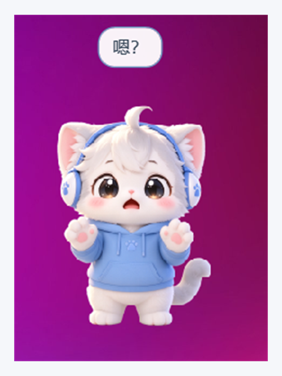
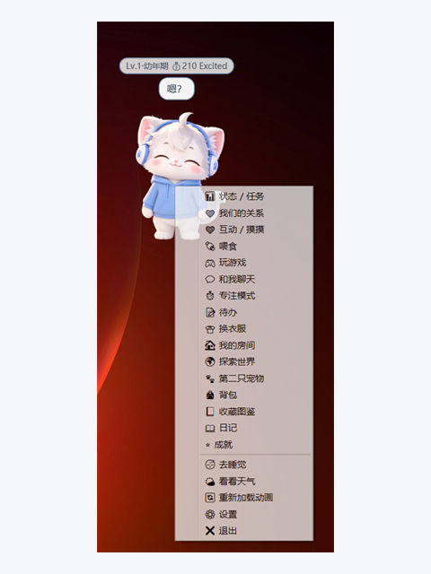

# 毛毛 AI 桌宠（Maomao AI Desktop Pet）

[English](README.md) | [中文](README.zh-CN.md)

> 住在 Windows 桌面上的小伙伴——可爱、可互动，并逐步成长为完整的 AI 桌宠。

<br/>

<table align="center">
  <tr>
    <td align="center" width="50%">
      
      <br/>
      <sub>认识毛毛</sub>
    </td>
    <td align="center" width="50%">
      
      <br/>
      <sub>右键菜单</sub>
    </td>
  </tr>
</table>

<br/>

---

## 这是什么？

**毛毛 AI 桌宠**（也可叫《小爪陪伴计划》）是一款 Windows 桌面陪伴程序。毛毛不只是循环动图，而是长期桌面伙伴：有情绪、饥饿、性格、房间、换装、任务、小游戏、日记、梦境、探索，以及可选的云端 AI。

一句话定位：

> **桌宠 = 陪伴 + 养成 + 互动 + 小游戏 + 桌面工具 + AI 人格**

设计优先级：

> **生命感 > 互动感 > 养成感 > 游戏性 > 数值系统**  
> 不要做成贴在桌面上的肝度手游。不做宠物死亡。

数据文件（与 exe 同目录，方便便携）：

- `save.json` — 完整游戏存档  
- `memory.json` — AI 长期记忆

---

## 功能一览

| 支柱 | 内容 |
|------|------|
| **存在感** | 透明置顶窗口、不进任务栏、序列帧与表情 |
| **生命感** | 走动 / 跑 / 跳 / 趴 / 哈欠 / 伸懒腰 / 睡觉；追鼠标；躲角落；边缘探头 |
| **即时反馈** | 靠近注视、点击连点文案、拖拽方向台词、落地、可点击气泡 |
| **养成** | 饱腹 / 心情 / 精力 / 清洁 / 好感 / 幸运 / 等级 / 金币；喂食；分区摸摸；睡觉；离线衰减；登录签到 |
| **成长** | 等级与成长阶段（仅展示进度）；每日任务；成就（含隐藏）；**功能全部开放，无等级门槛** |
| **装扮与家** | 服装 + 帽子图鉴；家具带加成；墙纸 / 季节主题 |
| **玩法** | 接小鱼、躲障碍、打地鼠、猜表情 |
| **AI 与故事** | 本地人格对话（可选 OpenAI 兼容云端）；记忆；日记；梦境 |
| **世界** | 探索地图与掉落；第二只宠物关系 |
| **桌面工具** | 25 分钟专注陪伴；待办；喝水 / 久坐 / 网络提醒；天气（Open-Meteo） |
| **陪伴感** | 生日；按时段问候；主动气泡；打扰模式与恶作剧档位 |

成长阶段（装饰用）：**幼年期**（&lt;10）→ **成长期**（&lt;20）→ **成熟期**（&lt;30）→ **特别形态**（30+）。

### 仍偏软 / 受美术限制（如实说明）

| 项目 | 说明 |
|------|------|
| 服装 / 帽子真实分层贴图 | 数据与图鉴可装备，尚未做独立贴图层 |
| 托盘图标 / 鼠标穿透 | 尚未实现 |
| 更深层系统挂钩（下载、CPU 发热） | 目前为网络与空闲提醒 |

---

## 展示与素材

| 素材 | 路径 | 用途 |
|------|------|------|
| 展示图 1（原图） | [`picture/Display Images1.png`](picture/Display%20Images1.png) | 角色 + 气泡 |
| 展示图 2（原图） | [`picture/Display Images2.png`](picture/Display%20Images2.png) | 桌宠 + 右键菜单 |
| README 双图 | [`picture/readme-showcase-1.png`](picture/readme-showcase-1.png) / [`2`](picture/readme-showcase-2.png) | 统一 480×640 文档用图 |
| 应用图标 | [`picture/icon.png`](picture/icon.png) | 源图 → `Assets/icon.ico` |
| 概念图 | [`picture/move.png`](picture/move.png) | 状态 / 互动参考 |
| 运行序列帧 | [`picture/deskpet_transparent_frames/`](picture/deskpet_transparent_frames/) | 透明抠图 PNG |

---

## 技术栈

| 项目 | 选型 |
|------|------|
| 语言 | C# |
| UI | WPF |
| 运行时 | .NET 8（Windows） |
| IDE | Visual Studio 2022 |
| 产出 | `MaomaoDesktopPet.exe` |
| 存档 | `System.Text.Json` |
| 可选 AI | OpenAI 兼容 Chat Completions HTTP |
| 天气 | [Open-Meteo](https://open-meteo.com/)（无需 Key） |

架构：透明 `MainWindow` 外壳 + `PetController` / 序列帧管线 + `AppServices` 领域层（养成、AI、探索、梦境、天气等）+ `Views/` 功能面板。

---

## 环境要求

- Windows 10 / 11  
- [.NET 8 SDK](https://dotnet.microsoft.com/download/dotnet/8.0) **或** 安装了 **.NET 桌面开发** 工作负载的 Visual Studio 2022  
- 网络可选（天气 / 云端 AI）

---

## 快速开始

### Visual Studio 2022

1. 打开 `MaomaoDesktopPet.sln`  
2. 选择 **Debug** 或 **Release**  
3. 按 **F5**（或「生成 → 生成解决方案」）  
4. 首次启动会进入引导（主人名、宠物名、性格、生日）  
5. 毛毛出现在屏幕右下角附近  

### 命令行

```powershell
cd "C:\Projects\Maomao AI Desktop Pet"
dotnet run --project src\MaomaoDesktopPet -c Release
```

Release 可执行文件：

```text
src\MaomaoDesktopPet\bin\Release\net8.0-windows\MaomaoDesktopPet.exe
```

---

## 使用说明

### 直接与桌宠互动

| 操作 | 效果 |
|------|------|
| **鼠标靠近** | 好奇 / hover 表情 |
| **左键点击** | 「嗯？」→ 连点 → 狂点文案 |
| **拖拽** | 「诶诶诶！」、左右台词、落地「啪！」 |
| **点击气泡** | 有动作的气泡会打开喂食 / 游戏 / 聊天 / 梦境等 |
| **待机** | 走、跑、跳、睡、伸懒腰、追鼠标、躲藏、探头、自言自语 |
| **右键** | 完整产品菜单 |

### 右键菜单（主要项）

状态与任务 · 我们的关系 · 摸摸 · 喂食 · 玩游戏 · 聊天 · 专注 · 待办 · 换衣服 · 房间 · 探索 · 第二只宠物 · 背包 · 收藏图鉴 · 日记 · 成就 · 睡觉 · 天气 · 重新加载动画 · 设置 · 退出  

### 设置要点

- 主人 / 宠物名字，性格（黏人 / 傲娇 / 软萌 / 沙雕 / 学霸 / 懒懒）  
- 打扰模式：**安静** / **陪伴** / **活跃**  
- 恶作剧：**关闭** / **轻度** / **完整**  
- 喝水提醒、久坐提醒、网络状态互动  
- 可选云端 AI：服务商预设（OpenAI / DeepSeek / 通义 / Ollama）、API Base、Key、Model、温度、Max Tokens、**测试连接**  
- 记忆与存档保存在 exe 同目录（`save.json` + `memory.json`）

### 小游戏

1. **接小鱼** — ←→ 或 A D 移动  
2. **躲障碍** — 空格 / W 跳跃  
3. **打地鼠** — 限时点击地鼠  
4. **猜表情** — 选择正确情绪  

通关可获得金币、经验与心情。

### 核心循环

```text
互动 → 爱心 / 金币 / 经验 → 养成 / 装扮 / 房间 → 解锁新内容 → 新互动 → 循环
```

食物包括：小鱼干、牛奶、饼干、蛋糕、草莓、苹果、糖果、猫罐头、神秘料理，以及黑暗料理（心情 −20 的整活）。

---

## 动画资源

序列帧放在**扁平目录**（构建时复制到 `Assets\Pet\`）：

```text
picture\deskpet_transparent_frames\
```

### 前缀 → 行为（共 59 帧）

| 前缀 | 行为 |
|------|------|
| `idle_` / `space_out_` | 待机 / 发呆 |
| `walk_` / `run_` / `spin_` | 移动 |
| `jump_01_` / `jump_desk_` | 跳跃 |
| `sleep_` / `yawn_` / `stretch_` / `lie_down_` / `sunbath_` | 休息 |
| `chase_` / `hide_` / `climb_window_` / `catch_butterfly_` | 桌面嬉戏 |
| `clean_` / `drink_` / `play_tail_` / `play_toy_` / `sneeze_` / `look_window_` | 日常生活 |
| `eat_fish_` / `eat_milk_` / `eat_cake_` / `eat_strawberry_` / `eat_snack_` | 喂食 |
| `inter_drag_*` / `inter_drop_` / `inter_click_` / `inter_mash_` / `inter_hover_` | 输入互动 |
| `exp_*` | 表情 |
| `talk_` / `find_item_` / `dream_` | 说话 / 事件 / 梦境 |
| `weather_rain_` / `weather_snow_` / `weather_sunny_` | 天气 |
| `time_morning_` / `time_noon_` / `time_evening_` / `time_night_` | 时段 |

命名示例：`idle_01_cutout.png`、`eat_fish_01_cutout.png`。

建议：

- 使用真正的 **Alpha 透明**（当前 cutout 已带透明通道）  
- 运行时按约 320px 宽度解码（源图 2048²）  
- 替换 PNG 后：重新编译，或使用「重新加载动画」

---

## 项目结构

```text
Maomao AI Desktop Pet/
├── MaomaoDesktopPet.sln
├── README.md                      # 英文（默认）
├── README.zh-CN.md                # 中文
├── .gitignore
├── picture/
│   ├── Display Images1.png / Display Images2.png
│   ├── readme-showcase-1.png / readme-showcase-2.png  # 统一 480×640
│   ├── icon.png
│   ├── move.png
│   └── deskpet_transparent_frames/
├── docs/superpowers/
│   ├── specs/                     # 设计说明
│   └── plans/                     # 实施计划
└── src/MaomaoDesktopPet/
    ├── Assets/
    │   ├── icon.ico
    │   └── Pet/                   # 复制后的序列帧
    ├── Core/                      # 状态、播放器、加载器、控制器
    ├── Models/                    # PetData、图鉴、解锁规则
    ├── Services/                  # 养成、AI、任务、探索、天气等
    ├── Views/                     # 功能面板 + 小游戏
    ├── MainWindow.xaml(.cs)       # 透明桌宠外壳 + 菜单
    ├── App.xaml(.cs)
    └── MaomaoDesktopPet.csproj
```

---

## 产品功能地图

```text
毛毛
├── 日常互动（摸摸、喂食、点击、拖拽、气泡、事件）
├── AI 大脑（对话、记忆、人格、主动搭话）
├── 养成成长（属性、等级进度、任务、成就；功能全开放）
├── 换装与房间（服装、帽子、家具加成、主题）
├── 小游戏
├── 故事（日记、梦境、回忆）
├── 桌面工具（专注、待办、轻提醒、天气）
└── 世界（探索、第二只宠物、季节 / 生日）
```

相关文档：

- [`docs/superpowers/specs/2026-09-30-maomao-v01-design.md`](docs/superpowers/specs/2026-09-30-maomao-v01-design.md)  
- [`docs/superpowers/plans/2026-10-08-full-feature-landing.md`](docs/superpowers/plans/2026-10-08-full-feature-landing.md)

---

## 本地开发提示

- 优先保证**生命感与操作手感**  
- 新帧放到 `picture/deskpet_transparent_frames/`，前缀清晰  
- 不要提交 `bin/`、`obj/`、`.vs/`（见 `.gitignore`）  
- 新系统放进 `Services/`，UI 保持在 `Views/` 薄层  
- 云端 AI Key 只存在本地存档 / 设置中，切勿提交密钥  

---

## 许可证

尚未指定。公开发布前请补充 `LICENSE`。

---

## 语言版本

- **默认（英文）：** [`README.md`](README.md)  
- **中文：** [`README.zh-CN.md`](README.zh-CN.md)
